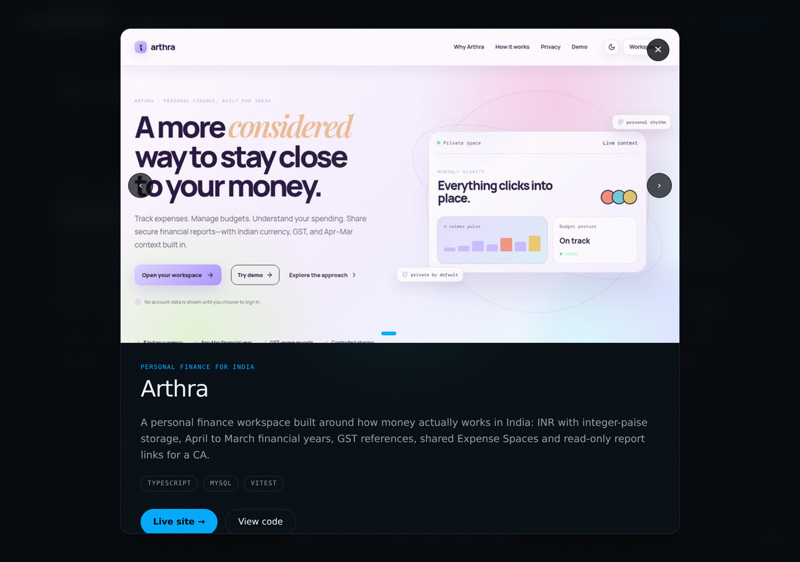
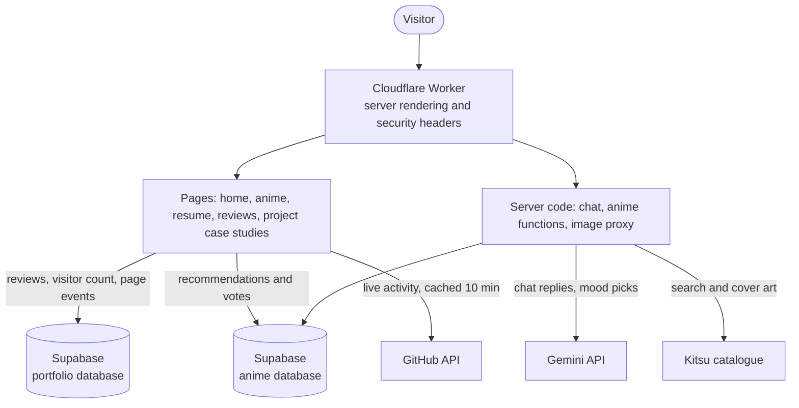
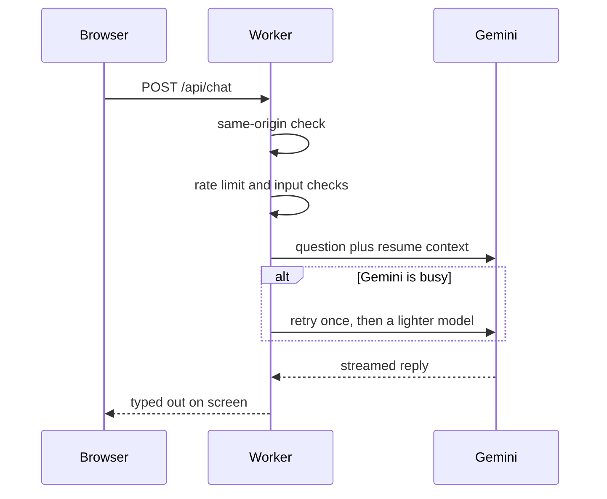

# Abhishek Rai A, portfolio

My personal portfolio: https://portfolio.abhirai2006.workers.dev

I'm a B.E. student in AI & ML at Mysore University. I made this site to show what I've built and to give recruiters a quick way to get answers about me without digging through links.


<table>
  <tr>
    <td></td>
    <td></td>
  </tr>
  <tr>
    <td align="center">The Arsenal: projects on a ring you can spin</td>
    <td align="center">Click a card to open it</td>
  </tr>
</table>

## What's on it

- **Home page** with a 3D background, a short intro, live numbers and a nav dock at the bottom. Press `Cmd/Ctrl + K` to jump anywhere.
- **GitHub activity** pulled live from the GitHub API (refreshed every 10 minutes), plus a contribution heatmap.
- **The Arsenal**, my projects on a slowly turning ring. Drag it, flick it, use the arrows or the keyboard, and click a card to open it. Each project also has a full case study page.
- **Ask Abhishek**, a small chat assistant. It only knows my resume and projects, and it won't make things up about me.
- **Anime shelf** at `/anime`: every anime I've finished on a 3D shelf, with mood-based picks and recommendations from visitors.
- **Reviews** at `/reviews`, where visitors can leave a note.
- **Résumé** at `/resume`, a clean printable version.

Projects on the site right now: Customer Churn Intelligence System, MUSE Students Voice, Arthra, Ittige, Git & GitHub Viva Prep, O(patience), Binary Search Visualizer and my C++ console mini-suite.

## A closer look

| | |
| --- | --- |
|  |  |
| Skills and how well I know them | Live GitHub activity |
|  |  |
| Ask Abhishek, the resume-only assistant | The way into the anime shelf |
|  |  |
| On a phone | Contact |

## How it's built

I wrote the ML and algorithm projects myself. For the web side of this site I used AI tools as a copilot, so I'm not listing it as a skill. This is just what the code uses:

| Part | What it uses |
| --- | --- |
| App | TanStack Start with React and TypeScript |
| Styling | Tailwind CSS 4 |
| 3D | Three.js |
| Database | Supabase (Postgres with row level security) |
| Chat and mood picks | Gemini API, called from the server |
| Hosting | Cloudflare Workers, built with Bun and Vite |

### How the pieces connect



### What happens when someone asks the chat a question



## Run it locally

You need Bun.

```bash
bun install
cp .env.example .env   # then fill it in
bun run dev
```

The dev server runs on http://localhost:8080.

### Environment variables

| Variable | Used for |
| --- | --- |
| `VITE_SITE_URL` | Public site address (no trailing slash). Used for canonical and share tags. |
| `VITE_SUPABASE_URL`, `VITE_SUPABASE_PUBLISHABLE_KEY`, `VITE_SUPABASE_PROJECT_ID` | Public Supabase values, built into the page. |
| `VITE_ANIME_SUPABASE_URL`, `VITE_ANIME_SUPABASE_PUBLISHABLE_KEY` | The database that holds the anime recommendations. |
| `AI_API_KEY` | Gemini key for the chat and mood picks. **Secret, server only.** |
| `AI_MODEL`, `AI_FALLBACK_MODEL` | Optional. Default to `gemini-flash-latest` and `gemini-flash-lite-latest`. |
| `AI_BASE_URL` | Optional. Point the chat at an OpenAI-compatible provider instead of Gemini. |
| `GITHUB_TOKEN` | Optional. Raises the GitHub API rate limit. **Secret.** |

Only public values go in `.env`. Secrets such as `AI_API_KEY` are added in Cloudflare as Secrets and never committed.

## Database

Reviews, the visitor counter and anonymous page events live in Supabase. To set up your own copy, create a project, open the SQL editor and run `supabase/setup.sql` once. The same steps are split into single files in `supabase/migrations/`.

Visitors can read and add rows, but they can't edit or delete anything. More in [SECURITY.md](SECURITY.md).

## Deploying

The site runs on Cloudflare Workers and rebuilds on every push to `main`.

- Build command: `bun run build`
- Deploy command: `npx wrangler deploy`
- Worker name: `portfolio` (set in `vite.config.ts`, it has to match the dashboard)

Cloudflare keeps two separate lists of variables:

- **Settings, Build, Variables and secrets** is for build-time values: `VITE_SITE_URL` and the `VITE_SUPABASE_*` ones.
- **Settings, Variables and Secrets** is for what the running site reads: `AI_API_KEY` (add it as a **Secret**), `SUPABASE_URL` and `SUPABASE_PUBLISHABLE_KEY`.

If the chat says "AI is not configured yet", the key is in the wrong list.

## Media files

Images, videos and the font live in `public/media/`. On a fresh clone, run `bash scripts/fetch-assets.sh` once to download the rest from my old site.

## Screenshots

To regenerate the images in `docs/screenshots/` from the live site:

```bash
npm i -D playwright && npx playwright install chromium
node scripts/screenshots.mjs https://portfolio.abhirai2006.workers.dev
```

## Contact

Email: abhirai2006@gmail.com
GitHub: [Abhirai2006](https://github.com/Abhirai2006)
LinkedIn: [abhishek-rai-a-00067238b](https://www.linkedin.com/in/abhishek-rai-a-00067238b)
