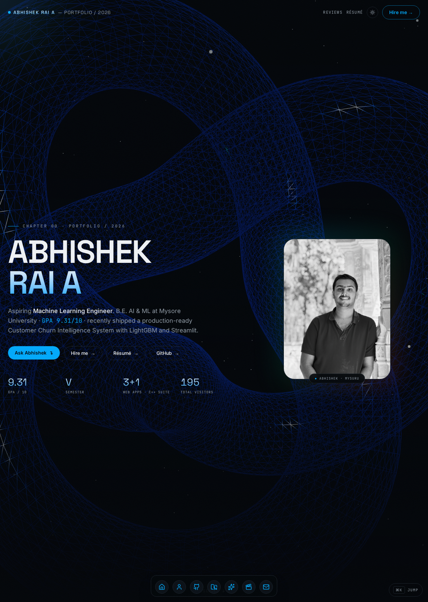
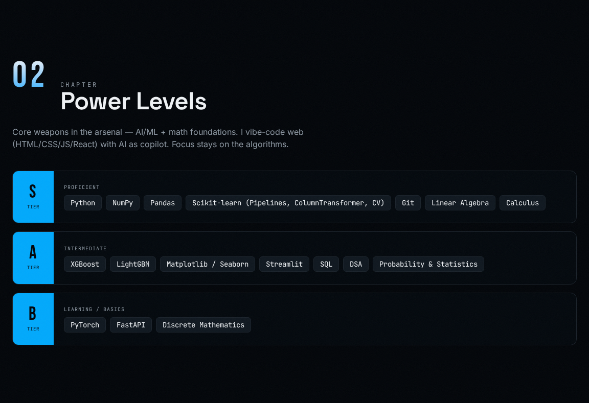
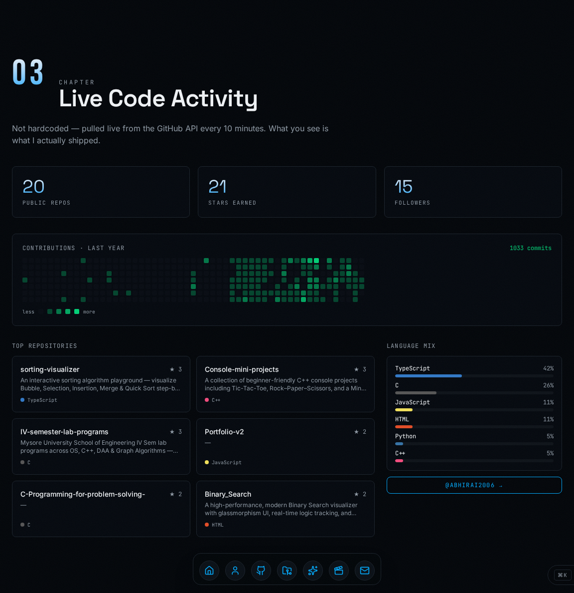
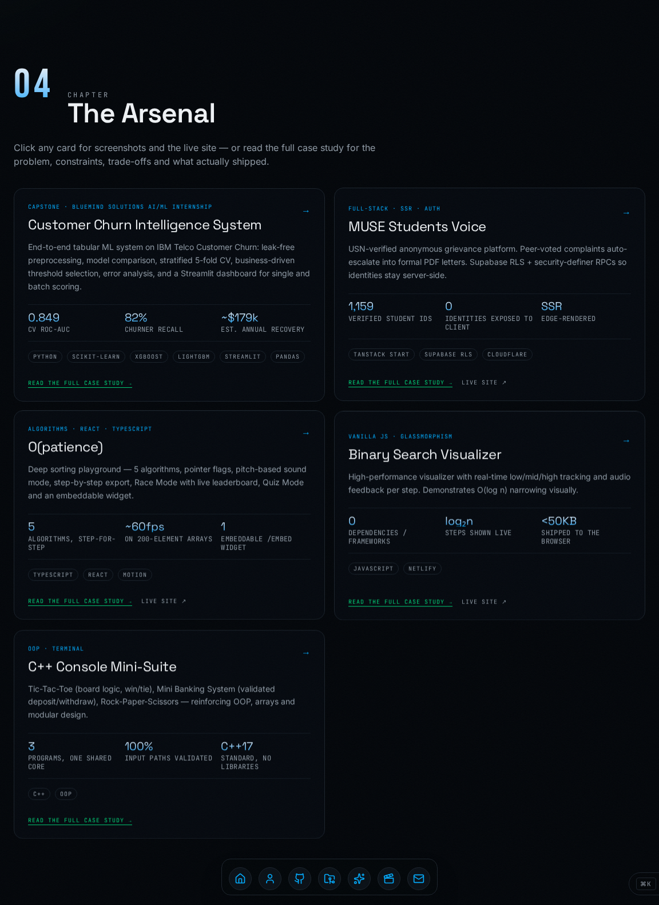
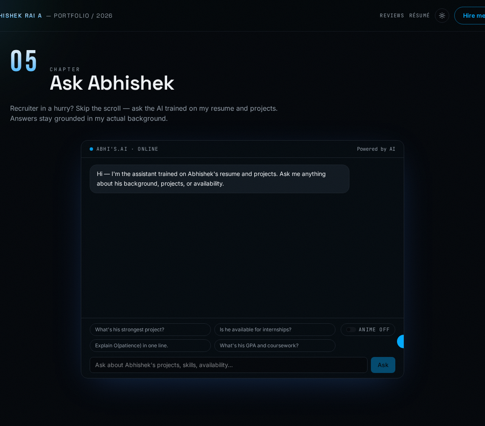
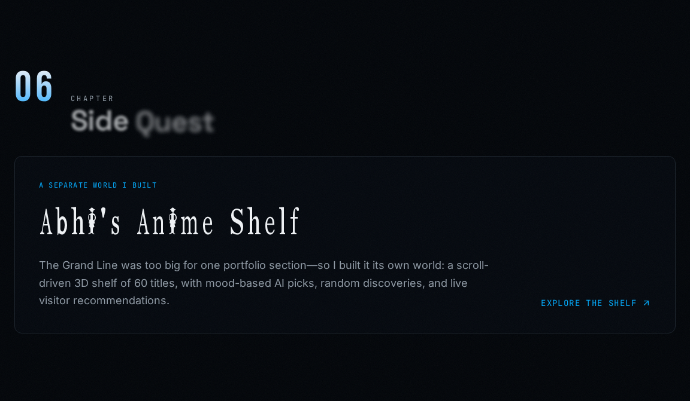
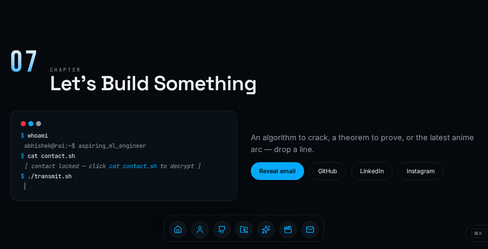
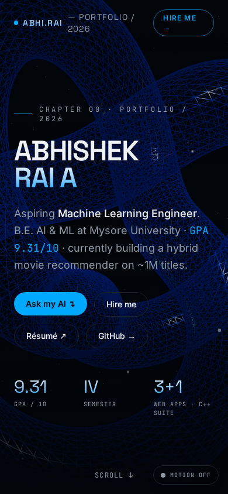

# Abhishek Rai A - Portfolio

The personal portfolio of **Abhishek Rai A**, a B.E. Artificial Intelligence & Machine Learning student at Mysore University School of Engineering. It is a recruiter-friendly, single-page story about shipped projects, current learning, live code activity, and the person behind the work.

**Live site:** https://portfolio.abhirai2006.workers.dev  
**Résumé:** https://portfolio.abhirai2006.workers.dev/resume



## What is included

- **A clear first screen** with Abhishek's current focus, GPA, semester, honest project count, portrait, résumé link, GitHub link, and a pre-filled “Hire me” email path.
- **Origin Story** with the Bluemind Solutions Core AI & ML internship, the Customer Churn Intelligence System capstone, and measurable model results.
- **Power Levels** that separate proficient, intermediate, and learning skills instead of presenting every tool as production experience.
- **Live Code Activity** with GitHub repository statistics, language mix, and a contribution heatmap fetched through cached server functions.
- **The Arsenal** with project cards, accessible click-to-open previews, screenshot carousels, terminal output for the C++ suite, live-site links, repository links, and full case-study pages.
- **Ask Abhishek** with streamed answers grounded in resume and lifestyle context. Anime Mode is optional and adds restrained Gen-Z phrasing and references from the anime shelf without changing factual answers.
- **Anime side quest** linking to the standalone [Abhi's Anime Shelf](https://abhi-anime-atlas.lovable.app/), a scroll-driven 3D watch log with mood-based AI picks, random discovery, and visitor recommendations.
- **Contact terminal** with the email and phone hidden until `cat contact.sh` is clicked, plus a copy-email action.
- **Public résumé, reviews, thank-you, and custom 404 pages** with page-specific metadata and responsive layouts.
- **A genuine visitor total** stored in Supabase. Each browser session is counted once, and the live distinct-session total is shown in the hero instead of using a placeholder number.
- **Light and dark themes**, keyboard-friendly controls, ARIA labels, responsive layouts, and reduced-motion support.

## Screens

| Hero | Power Levels |
| --- | --- |
|  |  |

| Live Code Activity | The Arsenal |
| --- | --- |
|  |  |

| Ask Abhishek | Anime side quest |
| --- | --- |
|  |  |

| Contact terminal | Mobile layout |
| --- | --- |
|  |  |

## Current project lineup

1. **Customer Churn Intelligence System** - leak-free preprocessing, model comparison, threshold tuning, error analysis, and a Streamlit scoring dashboard. Reported results: 0.849 cross-validation ROC-AUC, 82% churner recall, and an estimated ~$179k annual recoverable revenue.
2. **MUSE Students Voice** - USN-verified anonymous grievance platform with database-level access control, peer escalation, and formal PDF letters.
3. **O(patience)** - step-by-step sorting visualiser with five algorithms, pointer state, Race Mode, Quiz Mode, sound mode, and an embeddable view.
4. **Binary Search Visualizer** - dependency-free JavaScript visualiser showing low/mid/high movement, logarithmic narrowing, and audio feedback.
5. **C++ Console Mini-Suite** - Tic-Tac-Toe, a validated Mini Banking System, and Rock-Paper-Scissors using C++17 and standard-library concepts.

Each project has shared data in `src/lib/projects.ts`, a case-study page at `/projects/:slug`, and the right presentation for its format: screenshots for web projects and a terminal session for the C++ suite.

## Technology

| Area | Tools |
| --- | --- |
| Framework | TanStack Start, TanStack Router, React 19, TypeScript |
| Build and hosting | Vite 8, Bun, Nitro, Cloudflare Workers, ESLint, Prettier |
| Styling | Tailwind CSS v4, OKLCH semantic tokens, responsive CSS |
| 3D and motion | Three.js, React Three Fiber, Drei, Framer Motion, GSAP, Lenis |
| UI patterns | Accessible dialogs, command palette, MagicCard spotlight, Apple-style dock, carousels |
| Data and backend | Supabase (PostgreSQL), RLS, public server functions, anonymous analytics |
| AI | Gemini API (native streaming) with a fallback model, or any OpenAI-compatible endpoint |
| External data | GitHub REST API with server-side caching |
| Assets | Portrait, project screenshots, font and anime clips served from `public/media` |

## Architecture

```text
src/
├── routes/
│   ├── __root.tsx                 Shared shell, metadata, fonts, 404, error boundary
│   ├── index.tsx                  Main narrative portfolio chapters 00–07
│   ├── resume.tsx                 Indexable, print-friendly résumé
│   ├── reviews.tsx                Anonymous review form and published review wall
│   ├── thank-you.tsx              Review submission confirmation
│   ├── projects.$slug.tsx         Dynamic project case studies
│   └── api/chat.ts                Validated public chat endpoint with SSE output
├── components/
│   ├── portfolio/                 Hero, GitHub, chat, anime, cards, navigation
│   └── motion/                    Dock, magnetic buttons, counters, reveals, trails
├── lib/
│   ├── site.ts                    Canonical site URL from VITE_SITE_URL
│   ├── projects.ts                Shared project content, metrics, screenshots, links
│   ├── analytics.ts               Anonymous events and session-deduplicated visitor count
│   ├── github.functions.ts        Cached GitHub server functions
│   └── contact.ts                 Obfuscated contact data and mail templates
└── styles.css                     Theme tokens, font faces, motion, and accessibility rules
public/media/                      Images, videos and the font (see Assets below)
scripts/fetch-assets.sh            One-time download of the original media files
```

### Data flow

- The browser renders the public portfolio and uses the publishable backend client for anonymous review submissions and analytics.
- The visitor counter calls `record_site_visit(session_id)`. A unique browser session is inserted once, and the database returns the current total. No visitor identity or contact data is stored.
- GitHub data is loaded through TanStack server functions and cached for ten minutes so the public page stays fast and does not expose server-side implementation details.
- Chat requests are validated at `/api/chat`, trimmed to the most recent turns, enriched with the portfolio context, and streamed back as Server-Sent Events.
- Project content is local and typed, so cards, modals, case-study pages, and résumé entries stay aligned.

## Run locally

**Prerequisites:** Bun or Node 20+.

```bash
bun install
bun run dev       # http://localhost:8080
bun run build     # production build
bun run lint      # ESLint
bun run format    # Prettier
```

Copy `.env.example` to `.env` and fill it in:

| Variable | Where it is used | Notes |
| --- | --- | --- |
| `VITE_SITE_URL` | build | Public URL, no trailing slash. Used for canonical and Open Graph tags. |
| `VITE_SUPABASE_URL`, `VITE_SUPABASE_PUBLISHABLE_KEY`, `VITE_SUPABASE_PROJECT_ID` | build | Public, baked into the client bundle. |
| `SUPABASE_URL`, `SUPABASE_PUBLISHABLE_KEY`, `SUPABASE_PROJECT_ID` | runtime | Used by server-side code. |
| `AI_API_KEY` | runtime, secret | Gemini key for Ask Abhishek. Never give it a `VITE_` prefix. |
| `AI_MODEL`, `AI_FALLBACK_MODEL` | runtime, optional | Default to `gemini-flash-latest` and `gemini-flash-lite-latest`. |
| `AI_BASE_URL` | runtime, optional | Set it to use an OpenAI-compatible provider (Groq, OpenRouter) instead of native Gemini. |
| `GITHUB_TOKEN` | runtime, optional | Raises the GitHub API rate limit for the live activity section. |

## Database

Reviews, anonymous analytics and the visitor counter live in Supabase. To set up your own project, create one at supabase.com, open the SQL Editor, and run `supabase/setup.sql` once. Then put the project URL and publishable key into the Supabase variables above. The individual migrations are in `supabase/migrations/` if you prefer the CLI.

## Assets

All images, videos and the font live in `public/media/` and are referenced through the small `*.asset.json` files in `src/assets/`. The portrait is already there. On a fresh clone, run this once to pull the rest from the original site while it is still online:

```bash
bash scripts/fetch-assets.sh
```

Each file stays under Cloudflare's 25 MB limit for static assets.

## Ask Abhishek

`src/routes/api/chat.ts` accepts a validated message list and an `animeMode` flag. It keeps the latest twelve turns, applies the resume and lifestyle context, calls Gemini with streaming enabled, and forwards the SSE response to `AskAbhishek.tsx` for the typewriter effect. If Google returns a server error it retries once, then falls back to a lighter model before showing an error. Anime Mode is off by default and may add one subtle reference from the watched list while preserving grounded answers.

## Accessibility and performance

- Semantic headings, descriptive image alt text, keyboard-accessible dialogs and links, ARIA labels, and visible focus behavior.
- `prefers-reduced-motion` disables long-running motion, marquee movement, theme banners, and decorative animation.
- Heavy 3D code is lazy-loaded, media is served as static assets from Cloudflare, and GitHub requests are cached.
- Public routes have unique titles, descriptions, canonical URLs, Open Graph/Twitter metadata, and structured profile data where appropriate.

## Deployment

The site runs on Cloudflare Workers at https://portfolio.abhirai2006.workers.dev, built from GitHub through Workers Builds.

- **Build command:** `bun run build`
- **Deploy command:** `npx wrangler deploy`

Nitro generates the Wrangler config during the build. `vite.config.ts` sets the Worker name to `portfolio`, keeps dashboard variables across deploys (`keep_vars`), and turns on logs.

Cloudflare has two separate places for variables, and mixing them up is the usual reason the chat says "AI is not configured yet":

- **Settings → Build → Variables and secrets** is for build-time values only: `VITE_SITE_URL` and the `VITE_SUPABASE_*` variables.
- **Settings → Variables and Secrets** is for what the running site reads: `AI_API_KEY` (add it as a **Secret**), `SUPABASE_URL` and `SUPABASE_PUBLISHABLE_KEY`.

To deploy from a laptop instead: `bun run build`, then `npx wrangler login`, `npx wrangler deploy`, and `npx wrangler secret put AI_API_KEY`.

To target another host, set `NITRO_PRESET` (for example `vercel`). Nitro also detects Vercel on its own.

## Author

**Abhishek Rai A**  
[Portfolio](https://portfolio.abhirai2006.workers.dev) · [GitHub](https://github.com/Abhirai2006) · [LinkedIn](https://www.linkedin.com/in/abhishek-rai-a-00067238b)

## License

The source code is MIT-licensed. Personal content, résumé text, portrait, project screenshots, font, and anime media are © Abhishek Rai A and are not licensed for reuse.
